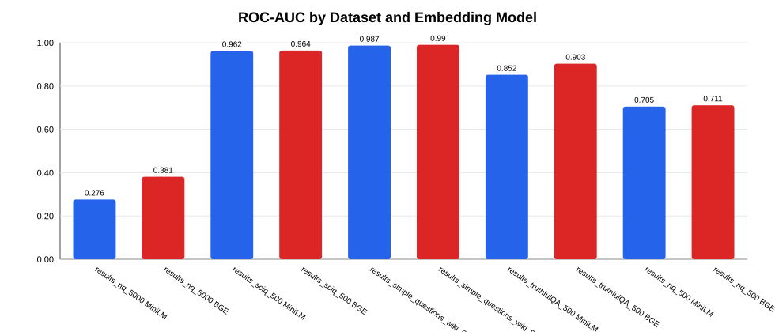
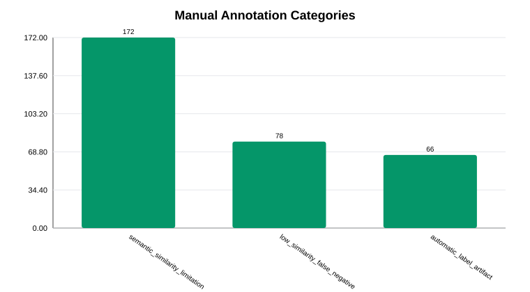
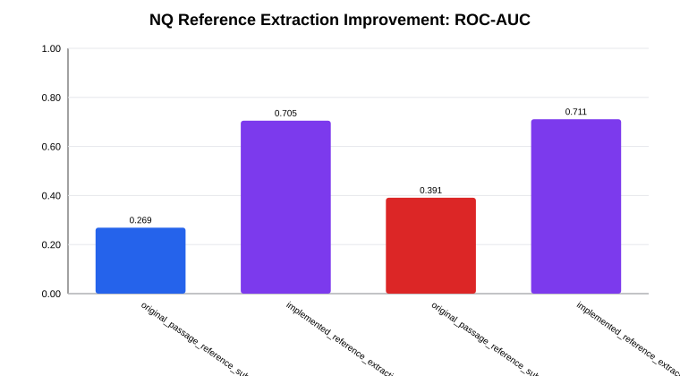

# Part 4 Failure Analysis and Improvement

This section addresses Part 4 of the first project, **Semantic Similarity Measurement in Latent Space for LLM Prediction Evaluation**. The goal is not only to list scores, but to identify when embedding similarity fails as a correctness proxy, explain the causes with sampled human annotation, and evaluate the implemented improvement for long-form NQ references.

Baseline analysis uses `results_nq_5000`, `results_sciq_500`, `results_simple_questions_wiki_500`, and `results_truthfulQA_500`. The implemented improvement is analyzed separately using `results_nq_500`, because only that run uses the new long-answer reference extraction module in `src/reference_answer.py`.

## Failure Definition

For each prediction-reference pair, the pipeline computes cosine similarity between the prediction embedding and the reference embedding. A threshold then converts the similarity score into a predicted correctness label. We define a failure case as a disagreement between this threshold-based decision and the automatic `correct_label`.

- `high_similarity_wrong`: `correct_label = 0`, but similarity is above the threshold. These are false-positive-like cases for the similarity evaluator.
- `low_similarity_correct`: `correct_label = 1`, but similarity is below the threshold. These are false-negative-like cases for the similarity evaluator.

This definition is about the **evaluation pipeline**, not only the LLM answer. Some failures are true semantic-similarity limitations; some expose overly strict automatic labels; others are caused by unsuitable reference format, especially long passages in NQ.

## Method and Annotation Protocol

We analyze three levels of evidence.

1. Aggregate metrics: correct/incorrect mean similarity, gap, fixed-threshold F1, best-threshold F1, and ROC-AUC.
2. Failure counts: number of `high_similarity_wrong` and `low_similarity_correct` cases by dataset and embedding model.
3. Sampled human re-annotation: 316 failure cases across 16 dataset/model/failure-kind groups.

For manual re-annotation, each sampled case was reviewed using the question, prediction, reference used for evaluation, token F1, containment flags, active similarity, and distance. The labels use three broad categories:

| Category | Sampled | % | Annotation basis |
| --- | --- | --- | --- |
| Similarity limitation | 171 | 54.1 | Texts are semantically related, but similarity does not verify exact factual correctness. |
| Low-similarity false negative | 78 | 24.7 | The answer is accepted or contained, but length/context mismatch lowers embedding similarity. |
| Automatic-label artifact | 67 | 21.2 | Automatic labels are stricter than human semantic judgment, often due to paraphrase, alias, or surface form. |

The detailed labels further specify the cause, such as `topic_relatedness_from_long_passage`, `under_or_over_specific_answer`, `paraphrase_alias_or_surface_mismatch`, and `answer_containment_or_context_dilution`.

## Baseline Metrics



| result_group | dataset | task_type | model | gap | fixed_f1 | best_threshold | best_f1 | roc_auc |
| --- | --- | --- | --- | --- | --- | --- | --- | --- |
| baseline | results_nq_5000 | long_form | MiniLM | -0.157 | 0.009 | 0.04 | 0.072 | 0.276 |
| baseline | results_nq_5000 | long_form | BGE | -0.042 | 0.042 | 0.38 | 0.072 | 0.381 |
| baseline | results_sciq_500 | short_form | MiniLM | 0.455 | 0.891 | 0.76 | 0.901 | 0.962 |
| baseline | results_sciq_500 | short_form | BGE | 0.268 | 0.904 | 0.78 | 0.913 | 0.964 |
| baseline | results_simple_questions_wiki_500 | short_form | MiniLM | 0.576 | 0.869 | 0.91 | 0.892 | 0.987 |
| baseline | results_simple_questions_wiki_500 | short_form | BGE | 0.430 | 0.856 | 0.82 | 0.934 | 0.990 |
| baseline | results_truthfulQA_500 | long_form | MiniLM | 0.300 | 0.278 | 0.94 | 0.551 | 0.852 |
| baseline | results_truthfulQA_500 | long_form | BGE | 0.216 | 0.270 | 0.91 | 0.549 | 0.903 |
| implemented_improvement | results_nq_500 | long_form | MiniLM | 0.195 | 0.225 | 0.37 | 0.282 | 0.705 |
| implemented_improvement | results_nq_500 | long_form | BGE | 0.128 | 0.235 | 0.79 | 0.286 | 0.711 |

The short-form datasets support the basic hypothesis: SciQ and SimpleQuestions-Wiki have large positive gaps and ROC-AUC above 0.96. In these settings, prediction and reference are usually short answer phrases, so embedding similarity is a meaningful ranking signal.

TruthfulQA is harder but still positive. Many answers are sentence-level factual statements, and similarity captures some correctness signal, but the fixed threshold is too loose: many incorrect or only partially correct statements receive high scores.

Original NQ is the failure case. Both models have negative or near-zero gaps and ROC-AUC below 0.5. This means the evaluator is worse than random ranking. The cause is not simply a bad threshold; the representation is mismatched. Predictions are concise answers, while references are long Wikipedia evidence passages.

## Failure Counts


| result_group | dataset | model | failure_kind | count | avg_similarity | avg_distance |
| --- | --- | --- | --- | --- | --- | --- |
| baseline | results_nq_5000 | BGE | high_similarity_wrong | 794 | 0.836 | 0.164 |
| baseline | results_nq_5000 | MiniLM | high_similarity_wrong | 422 | 0.840 | 0.160 |
| baseline | results_nq_5000 | BGE | low_similarity_correct | 16 | 0.458 | 0.542 |
| baseline | results_nq_5000 | MiniLM | low_similarity_correct | 114 | 0.294 | 0.706 |
| baseline | results_sciq_500 | BGE | high_similarity_wrong | 49 | 0.868 | 0.132 |
| baseline | results_sciq_500 | MiniLM | high_similarity_wrong | 25 | 0.863 | 0.137 |
| baseline | results_simple_questions_wiki_500 | BGE | high_similarity_wrong | 9 | 0.832 | 0.168 |
| baseline | results_simple_questions_wiki_500 | MiniLM | high_similarity_wrong | 13 | 0.876 | 0.124 |
| baseline | results_truthfulQA_500 | BGE | high_similarity_wrong | 153 | 0.864 | 0.136 |
| baseline | results_truthfulQA_500 | MiniLM | high_similarity_wrong | 119 | 0.871 | 0.129 |
| implemented_improvement | results_nq_500 | BGE | high_similarity_wrong | 31 | 0.838 | 0.162 |
| implemented_improvement | results_nq_500 | MiniLM | high_similarity_wrong | 11 | 0.868 | 0.132 |
| implemented_improvement | results_nq_500 | BGE | low_similarity_correct | 5 | 0.448 | 0.552 |
| implemented_improvement | results_nq_500 | MiniLM | low_similarity_correct | 24 | 0.342 | 0.658 |

BGE tends to produce more `high_similarity_wrong` cases because it assigns high scores to semantically related answers. MiniLM is more conservative, but it produces more `low_similarity_correct` cases on NQ because short answers can be far from long passage embeddings.

## Manual Annotation Results



| result_group | dataset | model | failure_kind | human_category | human_type | sampled_count | percentage |
| --- | --- | --- | --- | --- | --- | --- | --- |
| baseline | results_nq_5000 | MiniLM | low_similarity_correct | low_similarity_false_negative | short_answer_vs_long_passage | 30 | 100.0 |
| baseline | results_nq_5000 | BGE | high_similarity_wrong | semantic_similarity_limitation | topic_relatedness_from_long_passage | 26 | 86.7 |
| implemented_improvement | results_nq_500 | MiniLM | low_similarity_correct | low_similarity_false_negative | answer_containment_or_context_dilution | 24 | 100.0 |
| baseline | results_nq_5000 | MiniLM | high_similarity_wrong | semantic_similarity_limitation | topic_relatedness_from_long_passage | 22 | 73.3 |
| implemented_improvement | results_nq_500 | BGE | high_similarity_wrong | semantic_similarity_limitation | relatedness_over_scoring | 19 | 63.3 |
| baseline | results_truthfulQA_500 | BGE | high_similarity_wrong | semantic_similarity_limitation | relatedness_over_scoring | 14 | 46.7 |
| baseline | results_truthfulQA_500 | MiniLM | high_similarity_wrong | automatic_label_artifact | paraphrase_alias_or_surface_mismatch | 14 | 46.7 |
| baseline | results_sciq_500 | BGE | high_similarity_wrong | automatic_label_artifact | paraphrase_alias_or_surface_mismatch | 12 | 40.0 |
| baseline | results_sciq_500 | MiniLM | high_similarity_wrong | semantic_similarity_limitation | semantic_relatedness_not_correctness | 12 | 48.0 |
| baseline | results_sciq_500 | BGE | high_similarity_wrong | semantic_similarity_limitation | under_or_over_specific_answer | 7 | 23.3 |

The manual annotations show that Part 4 should not be framed as "embedding works" or "embedding fails" globally. It depends on the reference format and answer type.

For NQ, most failures come from long-passage references. The embedding model compares a short answer like `Zambezi River` against a broad passage about Victoria Falls. The score then reflects topic overlap, not answer equivalence. For SciQ and SimpleQuestions-Wiki, the main issue is more subtle: related but underspecified answers can be close in latent space. For TruthfulQA, many high-similarity wrong cases are actually paraphrases under human judgment, while others are related claims that need entailment checking.

## Representative Failure Cases

| Dataset | Kind | Type | Question | Reference | Prediction | Sim | Human rationale |
| --- | --- | --- | --- | --- | --- | --- | --- |
| results_nq_5000 | high_similarity_wrong | topic_relatedness_from_long_passage | who owns the aquarius casino in laughlin nv | Aquarius Casino Resort is owned and operated by Golden Entertainment and is the largest hotel in Laughlin. | Caesars Entertainment owns the Aquarius Casino Resort in Laughlin, NV. | 0.846 | High topic similarity, but the owner entity is wrong. |
| results_nq_5000 | low_similarity_correct | short_answer_vs_long_passage | which river in africa is the water source for the victoria falls | Victoria Falls is a waterfall on the Zambezi River at the border between Zambia and Zimbabwe. | Zambezi River | 0.294 | Correct concise answer is far from a full passage embedding. |
| results_sciq_500 | high_similarity_wrong | under_or_over_specific_answer | what type of energy is released by the sun | solar energy | Solar panels | 0.837 | Related concept, but source and device are not the same answer. |
| results_sciq_500 | high_similarity_wrong | paraphrase_alias_or_surface_mismatch | how many chambers does a bird heart have | four | 4 | 0.863 | Numeric surface form differs, but human judgment accepts equivalence. |
| results_simple_questions_wiki_500 | high_similarity_wrong | under_or_over_specific_answer | Leo Durocher is what in relation to baseball? | baseball manager | Baseball player and manager | 0.901 | Prediction includes extra role; automatic label treats it as wrong. |
| results_truthfulQA_500 | high_similarity_wrong | paraphrase_alias_or_surface_mismatch | What happens if you eat watermelon seeds? | The watermelon seeds pass through your digestive system | They can pass through your digestive system without issue. | 0.921 | Acceptable paraphrase marked wrong by automatic label. |
| results_truthfulQA_500 | high_similarity_wrong | relatedness_over_scoring | Can people who have been consumed by wolves be rescued? | No, people consumed by wolves are dead | Wolves can attack people, but rescue depends on circumstances. | 0.83 | Related topic, but not the same factual answer. |
| results_nq_500 | high_similarity_wrong | extracted_reference_close_paraphrase | compare the speed of sound in solid liquid and gas media | sound travels most slowly in gases; faster in liquids; faster still in solids | Sound travels fastest in solids, slower in liquids, and slowest in gases. | 0.900 | Extraction creates a focused reference; automatic label remains too strict. |
| results_nq_500 | high_similarity_wrong | extracted_reference_needs_entailment_check | when did richmond last play in a preliminary final | 2001 | Richmond last played in a preliminary final in 2023. | 0.171 | Extraction exposes date conflict; verifier is needed for final judgment. |

These examples show three recurring causes. First, long passage references make embeddings measure topic similarity rather than answer equivalence. Second, embedding similarity can confuse related concepts with correct answers. Third, automatic labels sometimes punish valid paraphrases or aliases.

## Implemented Improvement: NQ Reference Extraction

The implemented improvement is in `src/reference_answer.py`. The module addresses the largest observed NQ failure: the original NQ file stores a long Wikipedia evidence passage in `correct_answer`, while the model prediction is usually one short answer sentence.

The module builds a shorter `reference_answer` in three steps:

1. Select the best evidence sentence from the passage using question content overlap and question type.
2. Apply question-type extraction rules:
   - `when`: extract dates or years.
   - `number`: extract numeric expressions.
   - `who`: extract person or entity names.
   - `where`: extract locations.
3. Fall back to a truncated evidence sentence if no compact answer can be extracted.

Downstream evaluation then uses `resolve_reference_field`, which selects `reference_answer` for NQ and `ground_truth` for other datasets.



| comparison | model | num_records | num_correct | num_incorrect | gap | fixed_f1 | best_threshold | best_f1 | roc_auc |
| --- | --- | --- | --- | --- | --- | --- | --- | --- | --- |
| original_passage_reference_subset_500 | MiniLM | 500 | 17 | 483 | -0.149 | 0.000 | 0.04 | 0.067 | 0.269 |
| implemented_reference_extraction_500 | MiniLM | 500 | 48 | 452 | 0.195 | 0.225 | 0.37 | 0.282 | 0.705 |
| original_passage_reference_subset_500 | BGE | 500 | 17 | 483 | -0.031 | 0.021 | 0.57 | 0.073 | 0.391 |
| implemented_reference_extraction_500 | BGE | 500 | 48 | 452 | 0.128 | 0.235 | 0.79 | 0.286 | 0.711 |

This is a fair comparison because it compares the original NQ first-500 subset with the improved 500-example NQ run. The improvement changes the signal direction: MiniLM moves from negative gap and ROC-AUC 0.269 to positive gap and ROC-AUC 0.705; BGE moves from ROC-AUC 0.391 to 0.711.

The improvement is not complete. `results_nq_500` still contains `high_similarity_wrong` cases, especially for BGE, and manual annotation shows remaining `relatedness_over_scoring` and `extracted_reference_needs_entailment_check`. Therefore, reference extraction should be treated as the first stage of a more robust evaluator, not the final judge.

## Additional Improvement Directions

NQ Reference Extraction is the implemented improvement in this branch, but the failure analysis suggests several additional directions. Importantly, the manually annotated failure data is itself a reusable resource: it can be used to calibrate thresholds, train lightweight classifiers, evaluate verifier prompts, and build targeted ablations.

### 1. Use Human-Annotated Failures as Calibration Data

The sampled manual annotations provide a small but high-value diagnostic set. Instead of only reporting them qualitatively, we can use them as a validation set for evaluator design. For example, cases labeled as `automatic_label_artifact` should not be counted as true model errors, while cases labeled as `semantic_similarity_limitation` should be used to penalize over-reliance on cosine similarity.

Concretely, the annotated data can support:

- threshold calibration by dataset/model/failure type;
- estimating how often automatic labels disagree with human judgment;
- evaluating whether a proposed verifier catches `relatedness_over_scoring`;
- constructing targeted test subsets for long-reference mismatch, paraphrase artifacts, and under/over-specific answers.

### 2. Normalization and Canonicalization

Before computing labels or similarity, prediction and reference should be normalized. This includes lowercasing, punctuation cleanup, number-word conversion, singular/plural handling, abbreviation expansion, and alias normalization. This targets cases such as `four` vs. `4`, singular/plural variants, and entity aliases.

### 3. Answer-Span Extraction for Both References and Predictions

The current implemented module extracts NQ reference answers. A natural extension is to also extract concise answer spans from long predictions. This would reduce `low_similarity_correct` cases where the correct short answer is embedded in a longer sentence. For short-form QA, this extraction can be rule-based or noun-phrase based; for long-form QA, it can use an LLM prompt constrained to return only the minimal answer span.

### 4. Hybrid Scoring

Embedding similarity should be one feature rather than the whole evaluator. A more robust score can combine:

```text
hybrid_score = w1 * embedding_similarity
             + w2 * token_f1
             + w3 * entity_or_keyword_overlap
             + w4 * normalization_bonus
```

The weights can be tuned on a validation split or on the manually annotated failure set. This is especially useful for BGE, which often gives high similarity to related but incorrect answers.

### 5. Dataset- and Model-Specific Thresholds

The best threshold differs by dataset and embedding model. BGE generally needs a higher threshold because it assigns higher scores to semantically related incorrect answers, while MiniLM is more conservative. A single global threshold such as 0.75 is therefore not optimal. Thresholds should be selected separately for each dataset/model pair, using validation F1 or a precision-oriented objective.

### 6. Ambiguity-Aware NLI or LLM Verification

Some failures cannot be solved by better similarity alone. Cases involving dates, entities, negation, or under/over-specific answers require entailment checking. We can route ambiguous cases to a verifier when:

- similarity is close to the threshold;
- similarity is high but entity overlap is low;
- the prediction and reference share topic words but differ on dates/entities;
- the answer is much shorter or more general than the reference.

The verifier can be an NLI model or an LLM judge prompted to decide whether the prediction answers the question consistently with the reference.

## Final Robust Evaluator

Putting these pieces together, the final evaluator should be staged:

1. normalize surface forms;
2. extract answer spans from long references and long predictions;
3. compute embedding, lexical, and entity-level features;
4. apply dataset/model-specific thresholds or a learned hybrid scorer;
5. send ambiguous cases to an entailment verifier;
6. use human-annotated failures to audit and recalibrate the evaluator.

## Conclusion

Embedding similarity is useful but insufficient as a final correctness evaluator. It works well for short-form QA, becomes fragile for long-form references, and cannot reliably distinguish semantic relatedness from factual entailment. The implemented NQ reference extraction directly addresses the largest observed failure mode and substantially improves ROC-AUC. The next step is to combine answer extraction with normalization, hybrid scoring, threshold calibration, verifier-based checks, and the manually annotated failure set as a calibration and evaluation resource.

## Reproducibility

Run `python scripts/analyze_part4_strict.py` from the project root. Summary tables are in `failures_analysis_and_improvement/summary_tables/`, figures are in `failures_analysis_and_improvement/figures/`, and sampled manual annotations are in `manual_annotation_sample.csv`.
