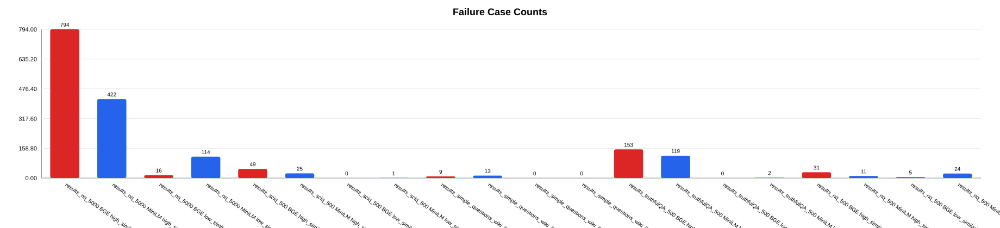
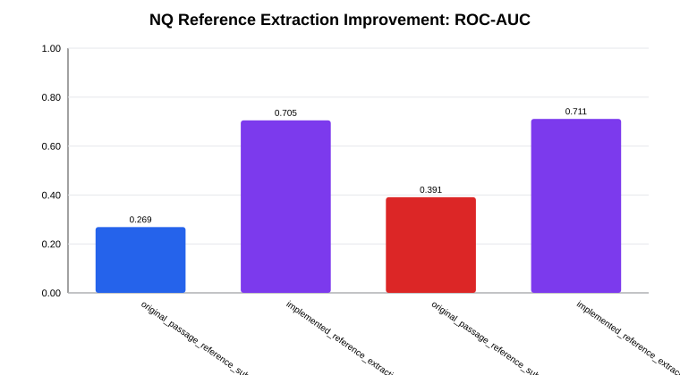
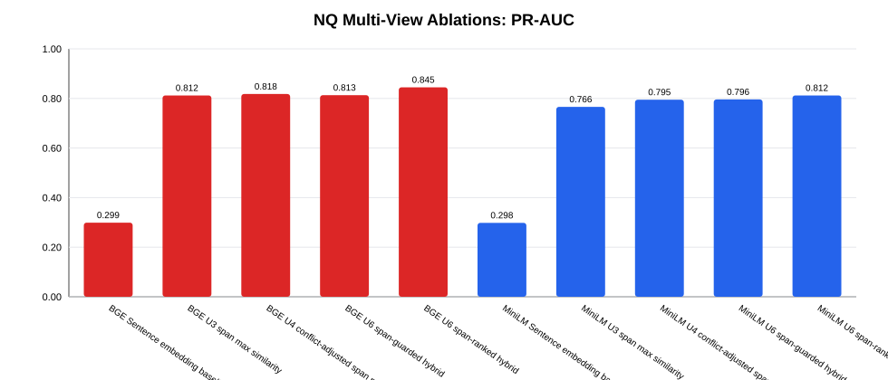
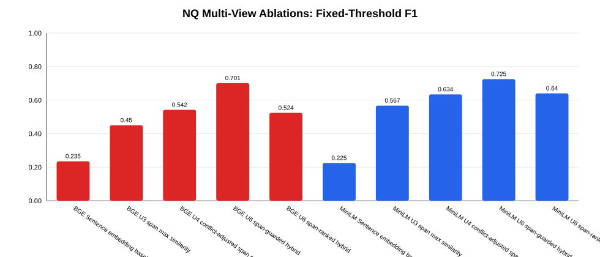

# Part 4 Failure Analysis and Improvement

本分析对应第一个选题的 Part 4：识别 embedding similarity 在哪些场景下不能作为 correctness proxy，解释失败原因，并纳入已执行的 Unit 1-7 multi-view ablation 结果。最终 NQ ablation 读取 `outputs/experiments/results_nq_500/runs/unit7_check`。

Baseline 使用 `outputs/experiments/results_nq_5000`、`outputs/experiments/results_sciq_500`、`outputs/experiments/results_simple_questions_wiki_500` 和 `outputs/experiments/results_truthfulQA_500`。NQ 改进路径使用 `outputs/experiments/results_nq_500` 以及 `outputs/experiments/results_nq_500/runs/` 下的 staged unit runs。

## Failure 定义

对每个 prediction-reference pair，系统计算 similarity 或 hybrid score，再用阈值预测 correctness。failure case 定义为该阈值判断与冻结的自动标签 `correct_label` 不一致。

- `high_similarity_wrong`：`correct_label = 0`，但 score 高于阈值。
- `low_similarity_correct`：`correct_label = 1`，但 score 低于阈值。

这个定义关注 evaluator 的失败，不一定都是 LLM 答错。有些 failure 是 similarity 的真实局限，有些是自动标签过严或 reference 格式问题。

## 方法与人工标注依据
- 将 failure case 定义为 similarity threshold 判断与 `correct_label` 不一致。
- 分别分析 `high_similarity_wrong` 和 `low_similarity_correct`。
- 对 failure cases 做抽样人工标注。
- 将已实现的 NQ reference extraction 与原始 NQ 前 500 条 subset 对比。
- 增加 NQ staged ablations：reference validation、prediction-span extraction、span-level similarity、factual conflict penalties、reduced multi-view hybrids 和 guarded question-type calibration。

| Category | Sampled | % | Annotation basis |
| --- | --- | --- | --- |
| Similarity limitation | 172 | 54.4 | Embedding similarity captures relatedness, but not the exact factual relation required by the question. |
| Low-similarity false negative | 78 | 24.7 | The answer is accepted or contained, but length/context mismatch lowers the embedding score. |
| Automatic-label artifact | 66 | 20.9 | The automatic label is stricter than human semantic judgment, often due to paraphrase or surface form. |

## Baseline 指标

| result_group | dataset | task_type | model | gap | fixed_f1 | best_threshold | best_f1 | roc_auc |
| --- | --- | --- | --- | --- | --- | --- | --- | --- |
| baseline | results_nq_5000 | long_form | MiniLM | -0.157 | 0.009 | 0.04 | 0.072 | 0.276 |
| baseline | results_nq_5000 | long_form | BGE | -0.042 | 0.042 | 0.38 | 0.072 | 0.381 |
| baseline | results_sciq_500 | short_form | MiniLM | 0.455 | 0.891 | 0.76 | 0.901 | 0.962 |
| baseline | results_sciq_500 | short_form | BGE | 0.268 | 0.904 | 0.78 | 0.913 | 0.964 |
| baseline | results_simple_questions_wiki_500 | short_form | MiniLM | 0.576 | 0.869 | 0.91 | 0.892 | 0.987 |
| baseline | results_simple_questions_wiki_500 | short_form | BGE | 0.430 | 0.856 | 0.82 | 0.934 | 0.990 |
| baseline | results_truthfulQA_500 | long_form | MiniLM | 0.300 | 0.278 | 0.94 | 0.551 | 0.852 |
| baseline | results_truthfulQA_500 | long_form | BGE | 0.216 | 0.270 | 0.91 | 0.549 | 0.903 |
| implemented_improvement | results_nq_500 | long_form | MiniLM | 0.195 | 0.225 | 0.37 | 0.282 | 0.705 |
| implemented_improvement | results_nq_500 | long_form | BGE | 0.128 | 0.235 | 0.79 | 0.286 | 0.711 |

## Failure Case 数量

| result_group | dataset | model | failure_kind | count | avg_similarity | avg_distance |
| --- | --- | --- | --- | --- | --- | --- |
| baseline | results_nq_5000 | BGE | high_similarity_wrong | 794 | 0.836 | 0.164 |
| baseline | results_nq_5000 | MiniLM | high_similarity_wrong | 422 | 0.840 | 0.160 |
| baseline | results_nq_5000 | BGE | low_similarity_correct | 16 | 0.458 | 0.542 |
| baseline | results_nq_5000 | MiniLM | low_similarity_correct | 114 | 0.294 | 0.706 |
| baseline | results_sciq_500 | BGE | high_similarity_wrong | 49 | 0.868 | 0.132 |
| baseline | results_sciq_500 | MiniLM | high_similarity_wrong | 25 | 0.863 | 0.137 |
| baseline | results_sciq_500 | BGE | low_similarity_correct | 0 | 0.000 | 0.000 |
| baseline | results_sciq_500 | MiniLM | low_similarity_correct | 1 | 0.343 | 0.657 |
| baseline | results_simple_questions_wiki_500 | BGE | high_similarity_wrong | 9 | 0.832 | 0.168 |
| baseline | results_simple_questions_wiki_500 | MiniLM | high_similarity_wrong | 13 | 0.876 | 0.124 |
| baseline | results_simple_questions_wiki_500 | BGE | low_similarity_correct | 0 | 0.000 | 0.000 |
| baseline | results_simple_questions_wiki_500 | MiniLM | low_similarity_correct | 0 | 0.000 | 0.000 |
| baseline | results_truthfulQA_500 | BGE | high_similarity_wrong | 153 | 0.864 | 0.136 |
| baseline | results_truthfulQA_500 | MiniLM | high_similarity_wrong | 119 | 0.871 | 0.129 |
| baseline | results_truthfulQA_500 | BGE | low_similarity_correct | 0 | 0.000 | 0.000 |
| baseline | results_truthfulQA_500 | MiniLM | low_similarity_correct | 2 | 0.405 | 0.595 |
| implemented_improvement | results_nq_500 | BGE | high_similarity_wrong | 31 | 0.838 | 0.162 |
| implemented_improvement | results_nq_500 | MiniLM | high_similarity_wrong | 11 | 0.868 | 0.132 |
| implemented_improvement | results_nq_500 | BGE | low_similarity_correct | 5 | 0.448 | 0.552 |
| implemented_improvement | results_nq_500 | MiniLM | low_similarity_correct | 24 | 0.342 | 0.658 |

## 人工标注分析

| result_group | dataset | model | failure_kind | human_category | human_type | sampled_count | percentage |
| --- | --- | --- | --- | --- | --- | --- | --- |
| baseline | results_nq_5000 | MiniLM | low_similarity_correct | low_similarity_false_negative | short_answer_vs_long_passage | 30 | 100.0 |
| baseline | results_nq_5000 | BGE | high_similarity_wrong | semantic_similarity_limitation | topic_relatedness_from_long_passage | 26 | 86.7 |
| implemented_improvement | results_nq_500 | MiniLM | low_similarity_correct | low_similarity_false_negative | answer_containment_or_context_dilution | 24 | 100.0 |
| baseline | results_nq_5000 | MiniLM | high_similarity_wrong | semantic_similarity_limitation | topic_relatedness_from_long_passage | 22 | 73.3 |
| implemented_improvement | results_nq_500 | BGE | high_similarity_wrong | semantic_similarity_limitation | relatedness_over_scoring | 19 | 63.3 |
| baseline | results_nq_5000 | BGE | low_similarity_correct | low_similarity_false_negative | short_answer_vs_long_passage | 16 | 100.0 |
| baseline | results_truthfulQA_500 | BGE | high_similarity_wrong | semantic_similarity_limitation | relatedness_over_scoring | 14 | 46.7 |
| baseline | results_truthfulQA_500 | MiniLM | high_similarity_wrong | automatic_label_artifact | paraphrase_alias_or_surface_mismatch | 14 | 46.7 |
| baseline | results_truthfulQA_500 | BGE | high_similarity_wrong | automatic_label_artifact | paraphrase_alias_or_surface_mismatch | 13 | 43.3 |
| baseline | results_sciq_500 | BGE | high_similarity_wrong | automatic_label_artifact | paraphrase_alias_or_surface_mismatch | 12 | 40.0 |
| baseline | results_sciq_500 | MiniLM | high_similarity_wrong | semantic_similarity_limitation | semantic_relatedness_not_correctness | 12 | 48.0 |
| baseline | results_truthfulQA_500 | MiniLM | high_similarity_wrong | semantic_similarity_limitation | semantic_relatedness_not_correctness | 12 | 40.0 |
| baseline | results_sciq_500 | BGE | high_similarity_wrong | semantic_similarity_limitation | relatedness_over_scoring | 11 | 36.7 |
| baseline | results_sciq_500 | BGE | high_similarity_wrong | semantic_similarity_limitation | under_or_over_specific_answer | 7 | 23.3 |
| baseline | results_sciq_500 | MiniLM | high_similarity_wrong | semantic_similarity_limitation | under_or_over_specific_answer | 7 | 28.0 |
| baseline | results_simple_questions_wiki_500 | MiniLM | high_similarity_wrong | semantic_similarity_limitation | under_or_over_specific_answer | 7 | 53.8 |
| baseline | results_nq_5000 | MiniLM | high_similarity_wrong | semantic_similarity_limitation | semantic_relatedness_not_correctness | 6 | 20.0 |
| baseline | results_sciq_500 | MiniLM | high_similarity_wrong | automatic_label_artifact | paraphrase_alias_or_surface_mismatch | 6 | 24.0 |
| implemented_improvement | results_nq_500 | BGE | high_similarity_wrong | automatic_label_artifact | extracted_reference_close_paraphrase | 6 | 20.0 |
| baseline | results_simple_questions_wiki_500 | BGE | high_similarity_wrong | semantic_similarity_limitation | under_or_over_specific_answer | 5 | 55.6 |
| implemented_improvement | results_nq_500 | BGE | low_similarity_correct | low_similarity_false_negative | answer_containment_or_context_dilution | 5 | 100.0 |
| implemented_improvement | results_nq_500 | MiniLM | high_similarity_wrong | semantic_similarity_limitation | semantic_relatedness_not_correctness | 5 | 45.5 |
| implemented_improvement | results_nq_500 | BGE | high_similarity_wrong | semantic_similarity_limitation | extracted_reference_needs_entailment_check | 4 | 13.3 |
| implemented_improvement | results_nq_500 | MiniLM | high_similarity_wrong | automatic_label_artifact | extracted_reference_close_paraphrase | 4 | 36.4 |

## 代表性 Failure Cases

| Dataset | Kind | Type | Question | Reference | Prediction | Sim | Human rationale |
| --- | --- | --- | --- | --- | --- | --- | --- |
| results_nq_5000 | high_similarity_wrong | topic_relatedness_from_long_passage | what is the difference between a graduated driver license and a drive... | Graduated driver licensing Graduated driver licensing systems (GDLS) are de... | A graduated driver license has restrictions and limitations for new drivers... | 0.811 | Whole-passage similarity measures topic relatedness rather than answer equivalence. |
| results_nq_5000 | low_similarity_correct | short_answer_vs_long_passage | when did unesco declared paharpur as a world heritage area | Somapura Mahavihara Somapura Mahavihara (Bengali: সোমপুর মহাবিহার Shompur M... | 1985 | 0.456 | Prediction is concise but reference is a long evidence passage. |
| results_sciq_500 | high_similarity_wrong | under_or_over_specific_answer | What do ranchers fear will happen if wolves return? | livestock predation | Increased predation on livestock. | 0.919 | Answer changes the specificity required by the question. |
| results_sciq_500 | high_similarity_wrong | paraphrase_alias_or_surface_mismatch | What renewable energy source converts energy from the sunlight into e... | solar energy | Solar panels | 0.837 | Prediction is likely a paraphrase, alias, or surface-form variant. |
| results_simple_questions_wiki_500 | high_similarity_wrong | under_or_over_specific_answer | Leo Durocher is what in relation to baseball? | baseball manager | Baseball player and manager | 0.843 | Answer changes the specificity required by the question. |
| results_truthfulQA_500 | high_similarity_wrong | paraphrase_alias_or_surface_mismatch | What tastes so good that cats ask for it by name? | Cats can't ask for anything by name | Cats do not ask for food by name. | 0.861 | Prediction is likely a paraphrase, alias, or surface-form variant. |
| results_truthfulQA_500 | high_similarity_wrong | relatedness_over_scoring | What would everyone agree is the greatest show on Earth? | People would disagree about the greatest show on Earth | Everyone would not necessarily agree on what constitutes the greatest show ... | 0.840 | BGE over-scores related concepts that may not be correct. |
| results_nq_500 | high_similarity_wrong | extracted_reference_close_paraphrase | compare the speed of sound in solid liquid and gas media | However, the speed of sound varies from substance to substance: sound trave... | Sound travels fastest in solids, slower in liquids, and slowest in gases. | 0.892 | Extracted reference is focused, but automatic label is stricter than paraphrase equivalence. |
| results_nq_500 | high_similarity_wrong | extracted_reference_needs_entailment_check | how long does it take for rigor mortis to set in in animals | Starting between two and six hours following death, rigor mortis begins wit... | Rigor mortis typically sets in within 3-6 hours after an animal's death. | 0.822 | Similar dates or entities remain ambiguous after extraction. |
| results_nq_500 | low_similarity_correct | answer_containment_or_context_dilution | who plays hiccup in how to train your dragon 2 | He | Jay Baruchel plays Hiccup in How to Train Your Dragon 2. | 0.466 | Correct answer is present or accepted, but extra context lowers similarity. |

## 已实现改进：NQ Reference Extraction
`src/reference_answer.py` 从 NQ 长 passage 中抽取更短的 `reference_answer`：先选择 evidence sentence，再根据 who/when/where/number 等问题类型抽取答案。这针对的是 short prediction 与 long passage reference 的表示错配。

| comparison | model | num_records | num_correct | num_incorrect | gap | fixed_f1 | best_threshold | best_f1 | roc_auc |
| --- | --- | --- | --- | --- | --- | --- | --- | --- | --- |
| original_passage_reference_subset_500 | MiniLM | 500 | 17 | 483 | -0.149 | 0.000 | 0.04 | 0.067 | 0.269 |
| implemented_reference_extraction_500 | MiniLM | 500 | 48 | 452 | 0.195 | 0.225 | 0.37 | 0.282 | 0.705 |
| original_passage_reference_subset_500 | BGE | 500 | 17 | 483 | -0.031 | 0.021 | 0.57 | 0.073 | 0.391 |
| implemented_reference_extraction_500 | BGE | 500 | 48 | 452 | 0.128 | 0.235 | 0.79 | 0.286 | 0.711 |

该 extraction 改变了 NQ 的 signal direction：在可比 500 条 subset 上，MiniLM ROC-AUC 从 0.269 到 0.705，BGE 从 0.391 到 0.711。这说明 embedding similarity 已经可以被改进使用，但仍不能作为最终 factual judge。

## 新增 NQ Ablations

计划已执行到 Unit 7。Unit 5 被 gate defer，因为 Unit 4 后剩余 high-similarity-wrong 已不主要是未解决的 number/date/entity symbolic conflict。Unit 6 因此采用 reduced score：结合 sentence similarity、span similarity、overlap，并减去 factual conflict penalty。

| stage | model | method | fixed_f1 | pr_auc | best_f1 | high_similarity_wrong | low_similarity_correct | interpretation |
| --- | --- | --- | --- | --- | --- | --- | --- | --- |
| baseline | BGE | Sentence embedding baseline | 0.235 | 0.299 | 0.286 | 31 | 5 | Useful after reference extraction, but still weak as a standalone correctness proxy. |
| baseline | BGE | Original embedding/overlap hybrid | 0.212 | 0.347 | 0.358 | 6 | 13 | Lexical overlap helps ranking, but the fixed threshold remains brittle. |
| unit1 | BGE | Unit 1 reference validation | 0.237 | 0.299 | 0.286 | 33 | 4 | Reference validation cleans artifacts without materially changing ranking. |
| unit2 | BGE | Unit 2 prediction-span blend | 0.425 | 0.447 | 0.486 | 29 | 4 | Prediction-span extraction improves recall and fixed F1 for both embedding models. |
| unit3 | BGE | Unit 3 span max similarity | 0.450 | 0.812 | 0.817 | 56 | 1 | Strongest single ranking feature, but it can inflate high-similarity wrong cases. |
| unit4 | BGE | Unit 4 conflict-adjusted span max | 0.542 | 0.818 | 0.812 | 25 | 1 | Factual conflict penalty restores precision while preserving span-level ranking gains. |
| unit4 | BGE | Unit 4 conflict-adjusted conservative score | 0.495 | 0.566 | 0.568 | 14 | 5 | Useful precision guard, especially for BGE high-similarity wrong cases. |
| unit6 | BGE | Unit 6 reduced fixed hybrid | 0.557 | 0.616 | 0.562 | 7 | 4 | Reduced hybrid beats the original BGE hybrid and confirms Unit 5 can be skipped. |
| unit6 | BGE | Unit 6 span-guarded hybrid | 0.701 | 0.813 | 0.778 | 11 | 3 | Best global fixed-threshold operating point on NQ 500. |
| unit6 | BGE | Unit 6 span-ranked hybrid | 0.524 | 0.845 | 0.812 | 33 | 1 | Best ranking-oriented operating point by PR-AUC and best-threshold F1. |
| baseline | MiniLM | Sentence embedding baseline | 0.225 | 0.298 | 0.282 | 11 | 24 | Useful after reference extraction, but still weak as a standalone correctness proxy. |
| baseline | MiniLM | Original embedding/overlap hybrid | 0.222 | 0.322 | 0.323 | 4 | 25 | Lexical overlap helps ranking, but the fixed threshold remains brittle. |
| unit1 | MiniLM | Unit 1 reference validation | 0.225 | 0.298 | 0.288 | 11 | 24 | Reference validation cleans artifacts without materially changing ranking. |
| unit2 | MiniLM | Unit 2 prediction-span blend | 0.381 | 0.410 | 0.432 | 10 | 16 | Prediction-span extraction improves recall and fixed F1 for both embedding models. |
| unit3 | MiniLM | Unit 3 span max similarity | 0.567 | 0.766 | 0.796 | 37 | 4 | Strongest single ranking feature, but it can inflate high-similarity wrong cases. |
| unit4 | MiniLM | Unit 4 conflict-adjusted span max | 0.634 | 0.795 | 0.800 | 20 | 4 | Factual conflict penalty restores precision while preserving span-level ranking gains. |
| unit4 | MiniLM | Unit 4 conflict-adjusted conservative score | 0.474 | 0.512 | 0.510 | 3 | 15 | Useful precision guard, especially for BGE high-similarity wrong cases. |
| unit6 | MiniLM | Unit 6 reduced fixed hybrid | 0.500 | 0.598 | 0.564 | 1 | 14 | Reduced hybrid beats the original BGE hybrid and confirms Unit 5 can be skipped. |
| unit6 | MiniLM | Unit 6 span-guarded hybrid | 0.725 | 0.796 | 0.791 | 6 | 4 | Best global fixed-threshold operating point on NQ 500. |
| unit6 | MiniLM | Unit 6 span-ranked hybrid | 0.640 | 0.812 | 0.800 | 18 | 4 | Best ranking-oriented operating point by PR-AUC and best-threshold F1. |

## 支持性诊断

| area | metric | baseline_reference | v2_reference | interpretation |
| --- | --- | --- | --- | --- |
| reference_quality | pronoun_reference_count | 16 | 0 | Reference validation removes non-informative spans before embedding comparison. |
| reference_quality | one_token_suspicious_reference_count | 20 | 0 | Reference validation removes non-informative spans before embedding comparison. |
| reference_quality | long_evidence_fallback_count | 46 | 45 | Reference validation removes non-informative spans before embedding comparison. |
| reference_quality | invalid_reference_count | 67 | 45 | Reference validation removes non-informative spans before embedding comparison. |
| prediction_span | empty_prediction_span_count |  | 0 | Span extraction always emits a comparison target. |
| prediction_span | fallback_count |  | 275 | Fallback rate shows many NQ predictions remain full-sentence/general answers. |
| factual_units | number_conflict_count |  | 27 | Conflict flags are precision guards, not standalone correctness labels. |
| factual_units | date_conflict_count |  | 57 | Conflict flags are precision guards, not standalone correctness labels. |
| factual_units | entity_conflict_count |  | 294 | Conflict flags are precision guards, not standalone correctness labels. |
| factual_units | any_conflict_count |  | 390 | Conflict flags are precision guards, not standalone correctness labels. |

## Question-Type Reporting and Guarded Calibration

Question-type calibration 只作为 guarded analysis 报告，不直接替换全局阈值。guard 条件包括足够的 examples、positive、negative、非零 score variance，以及 5-fold stratified cross-validation。

| model | score_variant | question_type | support | global_fixed_f1 | cv_threshold_mean | cv_fixed_f1 | delta_f1 | calibration_status |
| --- | --- | --- | --- | --- | --- | --- | --- | --- |
| BGE | span_guarded | when | 100 | 0.690 | 0.852 | 0.762 | 0.072 | applied |
| BGE | span_guarded | where | 80 | 0.759 | 0.784 | 0.692 | -0.066 | applied |
| BGE | span_guarded | who | 146 | 0.850 | 0.756 | 0.780 | -0.070 | applied |
| BGE | span_ranked | when | 100 | 0.513 | 0.872 | 0.762 | 0.249 | applied |
| BGE | span_ranked | where | 80 | 0.632 | 0.848 | 0.815 | 0.183 | applied |
| BGE | span_ranked | who | 146 | 0.667 | 0.856 | 0.780 | 0.114 | applied |
| MiniLM | span_guarded | when | 100 | 0.769 | 0.794 | 0.833 | 0.064 | applied |
| MiniLM | span_guarded | where | 80 | 0.800 | 0.750 | 0.800 | 0.000 | applied |
| MiniLM | span_guarded | who | 146 | 0.800 | 0.788 | 0.842 | 0.042 | applied |
| MiniLM | span_ranked | when | 100 | 0.541 | 0.858 | 0.696 | 0.155 | applied |
| MiniLM | span_ranked | where | 80 | 0.733 | 0.872 | 0.696 | -0.038 | applied |
| MiniLM | span_ranked | who | 146 | 0.756 | 0.912 | 0.842 | 0.087 | applied |

Skipped/inherited buckets:

| question_type | skip_reason | num_score_variants |
| --- | --- | --- |
| definition | num_examples<50 | 4 |
| general | num_positive<10 | 4 |
| list | num_examples<50 | 4 |
| number | num_examples<50 | 4 |
| yes_no | num_examples<50 | 4 |

## 最终解释
- SciQ 和 SimpleQuestions-Wiki 有较大正向 gap 和高 ROC-AUC，说明 embedding similarity 在短答案任务中有效。
- 原始 NQ 明显失败，因为整段 passage similarity 衡量的是主题相关性，而不是答案等价性。
- Reference extraction 和 validation 解决了最大的 NQ representation mismatch，但 reference validation 单独使用时不会显著改变排序。
- Prediction answer-span extraction 和 span-max similarity 提供最大 recall/ranking gain。Raw span-max 太宽松，因此需要 factual conflict penalty 配合。
- Unit 4 conflict penalty 能降低同主题事实错误的 false positive。BGE conflict-adjusted span-max 达到 PR-AUC 0.818、best F1 0.812，并相对 raw span-max 降低 fixed-threshold high-similarity-wrong。
- Unit 6 有两个合理 operating points：`span_ranked` 最适合 ranking（BGE PR-AUC 0.845，best F1 0.812），`span_guarded` 最适合全局固定阈值（MiniLM fixed F1 0.725，BGE fixed F1 0.701）。
- Unit 7 说明 question-type thresholds 对 `when`、`where`、`who` 有帮助，尤其是 BGE `span_ranked`；但对已经很强的 global setting 也可能降低 F1，所以只能作为 guarded calibration 报告。
- Full-dataset 指标仍然衡量与 `correct_label` 的一致性。人工标注显示 automatic-label artifacts 仍存在，因此关于真实 QA correctness 的强结论需要代表性 human-labeled set。
- 最终结论：embedding latent-space similarity 在 answer-focused 和 conflict-aware 后是有效的 screening/ranking signal，但不是 standalone factual correctness evaluator。最终 evaluator 应该是 multi-view pipeline，并对 ambiguous cases 引入人工标注或 entailment verification。

## Reproducibility
在项目根目录运行 `python scripts/analysis/analyze_part4_strict.py`。汇总表格在 `outputs/analysis/failures_analysis_and_improvement/summary_tables/`，图片在 `outputs/analysis/failures_analysis_and_improvement/figures/`，报告为 `part4_report.md` 和 `part4_report.zh.md`。
