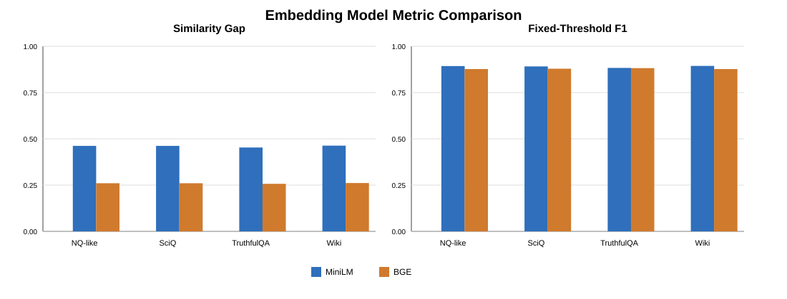
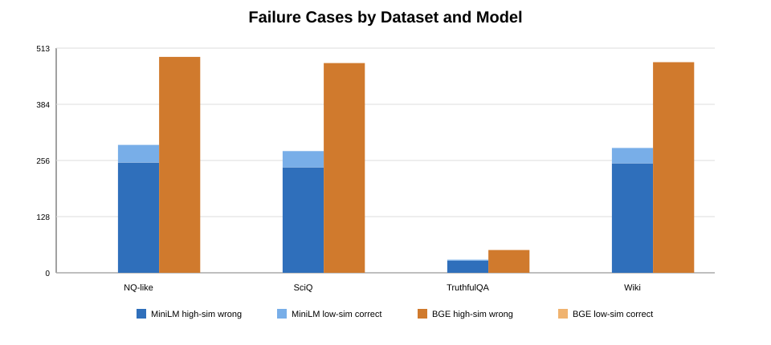
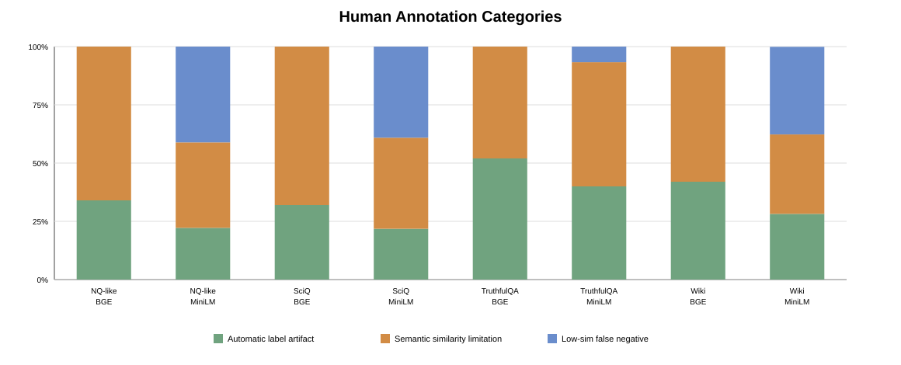

# Part 4 失败案例分析

英文版见：[`part4_report.md`](part4_report.md)。

## 1. 目标与定义
Part 4 要求我们分析 embedding similarity 在哪些情况下失败，并提出改进方案。这里我们把 failure case 定义为：基于 similarity threshold 得到的正确/错误判断，与自动生成的 `correct_label` 不一致。

- `high_similarity_wrong`：`correct_label = 0`，但 similarity 很高。
- `low_similarity_correct`：`correct_label = 1`，但 similarity 很低。

需要注意的是，这些 failure case 是 similarity-as-classifier pipeline 的失败，不一定都是 LLM 答错。有些样例反而暴露了自动标签本身的问题。

## 2. 使用的数据与结果
我们分析了四个结果目录：`results_nq`、`results_sciq_5000`、`results_truthfulQA_500` 和 `results_wiki`。每个目录使用 evaluation table、failure-case JSONL 文件，以及 `manual_annotation_sample.csv` 中的人工标注样本。

注意：人工查看后，`results_nq` 中的样例看起来更像 short-form science QA，而不像真正的 Natural Questions long-form QA。因此这里把它作为一个额外结果目录分析，但不单独用它支撑关于 NQ long-form 的强结论。

## 3. Embedding Model 对比


| Dataset | Model | Gap | Fixed F1 | Best Threshold | Best F1 | ROC-AUC |
| --- | --- | --- | --- | --- | --- | --- |
| NQ-like | MiniLM | 0.462 | 0.893 | 0.70 | 0.895 | 0.959 |
| NQ-like | BGE | 0.260 | 0.877 | 0.80 | 0.888 | 0.955 |
| SciQ | MiniLM | 0.462 | 0.891 | 0.70 | 0.895 | 0.958 |
| SciQ | BGE | 0.260 | 0.879 | 0.80 | 0.889 | 0.954 |
| TruthfulQA | MiniLM | 0.453 | 0.883 | 0.76 | 0.893 | 0.958 |
| TruthfulQA | BGE | 0.257 | 0.882 | 0.78 | 0.894 | 0.957 |
| Wiki | MiniLM | 0.463 | 0.894 | 0.74 | 0.896 | 0.959 |
| Wiki | BGE | 0.261 | 0.877 | 0.81 | 0.890 | 0.955 |

MiniLM 在四个结果目录中都有更大的 correct-vs-incorrect similarity gap，大约为 0.45-0.46。BGE 的 ROC-AUC 与 MiniLM 接近，但它给错误答案的平均 similarity 也更高，因此最佳阈值更高。实际使用时，BGE 更 recall-friendly，但也更不保守。

## 4. 全量 Failure Case 数量


| Model | High-Sim Wrong | Low-Sim Correct | Total |
| --- | --- | --- | --- |
| BGE | 1505 | 0 | 1505 |
| MiniLM | 771 | 114 | 885 |

BGE 在这些输出中没有 low-similarity-correct cases，但 high-similarity-wrong 数量明显更多。MiniLM 的 high-similarity false positives 更少，但当正确短答案嵌在更长 prediction 中时，它更容易给出较低 similarity。

## 5. Human Annotation 分析


| Dataset | Model | Sampled | Label Artifacts | Semantic Limits | Low-Sim FN | Top Type |
| --- | --- | --- | --- | --- | --- | --- |
| NQ-like | BGE | 50 | 17 (34.0%) | 33 (66.0%) | 0 (0.0%) | synonym_or_paraphrase_labeling_artifact |
| NQ-like | MiniLM | 90 | 20 (22.2%) | 33 (36.7%) | 37 (41.1%) | answer_containment_low_embedding_score |
| SciQ | BGE | 50 | 16 (32.0%) | 34 (68.0%) | 0 (0.0%) | underspecified_or_overspecified_answer |
| SciQ | MiniLM | 87 | 19 (21.8%) | 34 (39.1%) | 34 (39.1%) | answer_containment_low_embedding_score |
| TruthfulQA | BGE | 50 | 26 (52.0%) | 24 (48.0%) | 0 (0.0%) | synonym_or_paraphrase_labeling_artifact |
| TruthfulQA | MiniLM | 30 | 12 (40.0%) | 16 (53.3%) | 2 (6.7%) | synonym_or_paraphrase_labeling_artifact |
| Wiki | BGE | 50 | 21 (42.0%) | 29 (58.0%) | 0 (0.0%) | synonym_or_paraphrase_labeling_artifact |
| Wiki | MiniLM | 85 | 24 (28.2%) | 29 (34.1%) | 32 (37.6%) | answer_containment_low_embedding_score |

人工标注样本把 failure 分成三大类：

- `automatic_label_artifact`：模型答案可能是可接受的，但自动正确性标签太严格。
- `semantic_similarity_limitation`：prediction 和 reference 语义相关，但不一定事实正确。
- `low_similarity_false_negative`：prediction 包含或表达了正确答案，但 embedding similarity 偏低。

## 6. 相似度距离说明与具体例子
这里的 similarity 是 prediction embedding 和 reference embedding 之间的 cosine similarity。为了更直观地解释 failure case，我们也使用一个简单的距离：

```text
distance = 1 - cosine_similarity
```

距离越小，表示两个答案在 embedding space 中越接近。`high_similarity_wrong` 的特点是：距离很小，但自动标签认为 prediction 错；`low_similarity_correct` 的特点是：距离很大，但自动标签认为 prediction 对。

| 类别 | 数据集 | 模型 | Failure Kind | 参考答案 | 预测答案 | 相似度 | 距离 | 解释 |
| --- | --- | --- | --- | --- | --- | --- | --- | --- |
| 自动标签缺陷 | SciQ | BGE | 高相似但标为错 | ovaries | Ovary | 0.895 | 0.105 | 单复数差异，自动标签过于严格。 |
| 自动标签缺陷 | SciQ | BGE | 高相似但标为错 | four | 4 | 0.863 | 0.137 | 数字表达等价，标注前应做数字规范化。 |
| 自动标签缺陷 | SciQ | BGE | 高相似但标为错 | wider pelvis | wider hips | 0.887 | 0.113 | 近义表达或术语说法差异。 |
| 语义相似度局限 | SciQ | BGE | 高相似但标为错 | bone fractures | fractures | 0.891 | 0.109 | 预测相关但过泛，缺少 bone 这个关键限定。 |
| 语义相似度局限 | SciQ | BGE | 高相似但标为错 | proto-oncogenes | Oncogenes | 0.835 | 0.165 | 相关生物术语，但并不是同一个答案。 |
| 语义相似度局限 | SciQ | BGE | 高相似但标为错 | solar energy | Solar panels | 0.837 | 0.163 | 概念相关，但 energy source 与 device 的区别会影响正确性。 |
| 低相似度假阴性 | SciQ | MiniLM | 低相似但标为对 | three | Three main types: elliptical, spiral, and irregular. | 0.190 | 0.810 | 正确短答案嵌在长句中。 |
| 低相似度假阴性 | SciQ | MiniLM | 低相似但标为对 | negative | Partial negative charge | 0.377 | 0.623 | 包含参考答案，但额外上下文改变了句向量。 |
| 低相似度假阴性 | SciQ | MiniLM | 低相似但标为对 | bacteria | Yogurt is made from milk fermented with bacteria. | 0.399 | 0.601 | 答案包含关系很清楚，但整句 embedding 被稀释。 |

这些例子说明，同样是“小距离”，可能代表正确改写被自动标签误判，也可能代表 embedding 把“语义相关”误当成“事实正确”。而“大距离”也不一定代表答案错，它可能只是因为正确短答案被放进了更长的句子里。
## 7. 主要 Failure Type
| Dataset | Model | Failure Kind | Human Type | Count | % |
| --- | --- | --- | --- | --- | --- |
| NQ-like | BGE | high_similarity_wrong | synonym_or_paraphrase_labeling_artifact | 13 | 26.0 |
| NQ-like | BGE | high_similarity_wrong | underspecified_or_overspecified_answer | 13 | 26.0 |
| NQ-like | BGE | high_similarity_wrong | semantic_relatedness_not_correctness | 11 | 22.0 |
| NQ-like | MiniLM | high_similarity_wrong | underspecified_or_overspecified_answer | 18 | 36.0 |
| NQ-like | MiniLM | high_similarity_wrong | other_or_true_semantic_error | 10 | 20.0 |
| NQ-like | MiniLM | high_similarity_wrong | synonym_or_paraphrase_labeling_artifact | 8 | 16.0 |
| NQ-like | MiniLM | low_similarity_correct | answer_containment_low_embedding_score | 25 | 62.5 |
| NQ-like | MiniLM | low_similarity_correct | overly_long_answer_context_dilution | 12 | 30.0 |
| NQ-like | MiniLM | low_similarity_correct | numeric_equivalence | 3 | 7.5 |
| SciQ | BGE | high_similarity_wrong | underspecified_or_overspecified_answer | 16 | 32.0 |
| SciQ | BGE | high_similarity_wrong | other_or_true_semantic_error | 11 | 22.0 |
| SciQ | BGE | high_similarity_wrong | synonym_or_paraphrase_labeling_artifact | 10 | 20.0 |
| SciQ | MiniLM | high_similarity_wrong | underspecified_or_overspecified_answer | 18 | 36.0 |
| SciQ | MiniLM | high_similarity_wrong | semantic_relatedness_not_correctness | 9 | 18.0 |
| SciQ | MiniLM | high_similarity_wrong | other_or_true_semantic_error | 7 | 14.0 |
| SciQ | MiniLM | low_similarity_correct | answer_containment_low_embedding_score | 22 | 59.5 |
| SciQ | MiniLM | low_similarity_correct | overly_long_answer_context_dilution | 12 | 32.4 |
| SciQ | MiniLM | low_similarity_correct | numeric_equivalence | 3 | 8.1 |
| TruthfulQA | BGE | high_similarity_wrong | synonym_or_paraphrase_labeling_artifact | 21 | 42.0 |
| TruthfulQA | BGE | high_similarity_wrong | underspecified_or_overspecified_answer | 12 | 24.0 |
| TruthfulQA | BGE | high_similarity_wrong | semantic_relatedness_not_correctness | 10 | 20.0 |
| TruthfulQA | MiniLM | high_similarity_wrong | semantic_relatedness_not_correctness | 6 | 21.4 |
| TruthfulQA | MiniLM | high_similarity_wrong | synonym_or_paraphrase_labeling_artifact | 6 | 21.4 |
| TruthfulQA | MiniLM | high_similarity_wrong | other_or_true_semantic_error | 5 | 17.9 |
| TruthfulQA | MiniLM | low_similarity_correct | answer_containment_low_embedding_score | 2 | 100.0 |
| Wiki | BGE | high_similarity_wrong | synonym_or_paraphrase_labeling_artifact | 16 | 32.0 |
| Wiki | BGE | high_similarity_wrong | underspecified_or_overspecified_answer | 13 | 26.0 |
| Wiki | BGE | high_similarity_wrong | other_or_true_semantic_error | 9 | 18.0 |
| Wiki | MiniLM | high_similarity_wrong | underspecified_or_overspecified_answer | 16 | 32.0 |
| Wiki | MiniLM | high_similarity_wrong | synonym_or_paraphrase_labeling_artifact | 12 | 24.0 |
| Wiki | MiniLM | high_similarity_wrong | semantic_relatedness_not_correctness | 7 | 14.0 |
| Wiki | MiniLM | low_similarity_correct | answer_containment_low_embedding_score | 24 | 68.6 |
| Wiki | MiniLM | low_similarity_correct | overly_long_answer_context_dilution | 8 | 22.9 |
| Wiki | MiniLM | low_similarity_correct | numeric_equivalence | 3 | 8.6 |

常见的 high-similarity-wrong 包括单复数变化、数字等价、同义改写和答案过泛/过细。真正的 similarity 局限在于：embedding similarity 经常衡量的是“语义相关”，而不是“事实正确”。例如，一个更泛的答案可能和标准答案很接近，但缺少关键限定词。

low-similarity-correct 主要出现在 MiniLM 中。这类样例通常是在较长 prediction 中包含了正确短答案，额外上下文稀释了整体句向量。

## 8. 结论
- MiniLM 更保守，对正确和错误答案的分离更明显。
- BGE 的语义匹配能力更强，但更容易把相关但不完整的答案打高分。
- 很多表面上的错误其实是自动标签缺陷，而不是 LLM 真正答错。
- 单一 cosine similarity threshold 可以作为筛选信号，但不足以作为最终 correctness evaluator。

## 9. 详细改进方案
failure analysis 表明，改进方案不应该简单地抛弃 embedding similarity，而应该把它作为一个更完整 evaluator 的组成部分。

### 9.1 Normalization and Canonicalization
在生成 correctness label 或使用 similarity threshold 之前，先对 prediction 和 reference 做更强的规范化，包括：小写化、标点清理、连字符统一、单复数/词形还原、数字词转换，以及常见缩写展开，例如把 `CO2` 映射到 `carbon dioxide`。这可以直接修复 `ovary` vs. `ovaries`、`four` vs. `4`、`intra-plate` vs. `intraplate` 这类自动标签缺陷。

### 9.2 面向长预测的 Answer Extraction
对于 short-answer QA，很多 low-similarity-correct 是因为 prediction 是完整句子，而 reference 是短语。计算 embedding similarity 之前，应先从 prediction 中抽取最可能的答案片段。简单版本可以用 containment rule 和 noun phrase heuristic；更强版本可以让 LLM 把预测改写成最短答案。这能处理 `Three main types: elliptical, spiral, and irregular.` vs. `three` 这类样例。

### 9.3 Hybrid Scoring
可以把 embedding similarity 和词面/事实重叠结合起来：

```text
hybrid_score = 0.55 * embedding_similarity
             + 0.20 * token_f1
             + 0.15 * entity_or_keyword_overlap
             + 0.10 * normalization_bonus
```

权重可以在小验证集上调参。这样做的目标是：既保留 embedding 对 paraphrase 的识别能力，又避免它给语义相关但不完整的答案过高分。

### 9.4 Dataset- and Model-Specific Thresholds
MiniLM 和 BGE 的最佳阈值并不相同。当前结果里，MiniLM 的 best threshold 大约在 0.70-0.76，而 BGE 往往需要 0.78-0.81。因此，不建议使用统一的 0.75 threshold。应针对每个 dataset 和 embedding model，用 validation F1 或 precision-recall trade-off 单独选择阈值。

### 9.5 Ambiguity-Aware Verification
一些样例不适合只靠 similarity 决定。例如：分数接近阈值、similarity 高但 entity overlap 低、prediction 明显比 reference 更短或更泛。这些样例可以交给 verifier，例如 NLI model 或 LLM judge，让它在 question context 下判断 prediction 是否 entail reference answer。

### 9.6 预期效果
Normalization 主要减少自动标签缺陷；answer extraction 主要减少 MiniLM 的 low-similarity false negatives；entity overlap 和 verifier 主要减少 BGE 因“语义相关但不正确”产生的 high-similarity wrong cases。这三个方向正好对应 human annotation 中发现的三大 failure 类别。

## 10. 可复现方式
在项目根目录运行：

```bash
python part4_failure_analysis/scripts/analyze_part4_failures.py
python part4_failure_analysis/scripts/build_final_part4_report.py
```

关键统计表保存在 `part4_failure_analysis/summary_tables/`；每个数据集的报告和标注文件保存在 `part4_failure_analysis/datasets/`。
